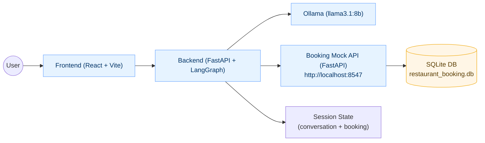

# TableBooker AI Agent 🍽️

A production-ready conversational AI agent for restaurant booking management, built with **LangGraph** and **Ollama** to provide intelligent, context-aware booking services through natural language conversations.

## 📋 Overview

TableBooker is an enterprise-grade chat interface that transforms restaurant booking from a rigid form-based process into an intuitive, conversational experience. The system integrates with restaurant management APIs to provide real-time availability checking, intelligent booking creation, and comprehensive reservation management.

It is designed to work seamlessly with an enhanced Mock Booking API server fork that includes multi-restaurant support for 4 venues — TheHungryUnicorn, PizzaPalace, SushiZen, and CafeBistro. See the forked repository here: [Nikitich2033/Restaurant-Booking-Mock-API-Server](https://github.com/Nikitich2033/Restaurant-Booking-Mock-API-Server).

### **Core Capabilities**
- **Multi-Restaurant Support**: Seamlessly manage bookings across multiple restaurant locations
- **Natural Language Processing**: Understand and respond to conversational booking requests
- **Real-Time Availability**: Database-driven availability checking with instant responses
- **Complete CRUD Operations**: Create, read, update, and cancel reservations
- **Context-Aware Conversations**: Maintain conversation state across multiple turns
- **Edge Case Handling**: Intelligent management of cancelled bookings and policy questions

## 🚀 Getting Started

### **Prerequisites**
- Python 3.8+ with pip
- Node.js 16+ with npm
- Ollama installed locally
- Git for repository access

### **Installation Steps**

1. **Clone the Repository**
   ```bash
   git clone https://github.com/your-username/restaurant-booking-chat-agent.git
   cd restaurant-booking-chat-agent
   ```

2. **Backend Setup**
   ```bash
   cd backend
   pip install -r requirements.txt
   python main.py
   ```

3. **Frontend Setup**
   ```bash
   cd frontend
   npm install
   npm run dev
   ```

4. **Start Ollama Service**
   ```bash
   ollama serve
   ollama pull llama3.1:8b
   ```

5. **Clone and Launch the Mock API Server (Enhanced fork — 4 restaurants)**
   Repository: [Nikitich2033/Restaurant-Booking-Mock-API-Server](https://github.com/Nikitich2033/Restaurant-Booking-Mock-API-Server)
   ```bash
   # From your workspace root (or a sibling directory)
   git clone https://github.com/Nikitich2033/Restaurant-Booking-Mock-API-Server.git
   cd Restaurant-Booking-Mock-API-Server
   pip install -r requirements.txt
   python -m app
   # Server runs on http://localhost:8547
   ```

### **Quick Test**
   ```bash
curl -X POST http://localhost:8000/chat \
  -H "Content-Type: application/json" \
  -d '{"message": "Hi, I need a table for 4 people tonight", "session_id": "test"}'
```

## 🏗️ Design Rationale (Concise)

### Why these technologies
- **FastAPI (backend)**: Async-first, type hints, and OpenAPI docs out of the box. Great perf for chat-style APIs and easy to scale horizontally.
- **LangGraph (agent runtime)**: Deterministic, stateful conversation flow with explicit nodes/edges. Makes long-running, multi-turn interactions testable and debuggable.
- **Ollama + llama3.1:8b (LLM)**: Local inference keeps data private and eliminates API costs/rate limits. 8B strikes a balance between quality and speed for booking intents. Chosen for cost-effectiveness.
- **SQLite + SQLAlchemy (data)**: Zero-ops local DB during development; can migrate to PostgreSQL/MySQL in production with minimal code changes.
- **React + Vite (frontend)**: Fast DX and a simple, modern chat UI. Card rendering is driven by structured `booking_data` from the API.

## 🔌 API Integration

- **Base URL**: `http://localhost:8547`
- **Auth**: All endpoints require Bearer token authentication via `Authorization: Bearer <token>`
- **Content-Type**: `application/x-www-form-urlencoded` for POST/PATCH bodies
- **Default restaurant microsite**: `TheHungryUnicorn` (others: `PizzaPalace`, `SushiZen`, `CafeBistro`)

### Endpoints used by the agent
- Check availability
  - `POST /api/ConsumerApi/v1/Restaurant/{restaurant_name}/AvailabilitySearch`
  - Body: `VisitDate=YYYY-MM-DD&PartySize=NN&ChannelCode=ONLINE`
- Create booking
  - `POST /api/ConsumerApi/v1/Restaurant/{restaurant_name}/BookingWithStripeToken`
  - Body: `VisitDate`, `VisitTime=HH:MM:SS`, `PartySize`, `ChannelCode=ONLINE`, plus optional `Customer[FirstName]`, `Customer[Surname]`, `Customer[Email]`, `Customer[Mobile]`, `SpecialRequests`
- Get booking
  - `GET /api/ConsumerApi/v1/Restaurant/{restaurant_name}/Booking/{booking_reference}`
- Update booking
  - `PATCH /api/ConsumerApi/v1/Restaurant/{restaurant_name}/Booking/{booking_reference}`
  - Body: any of `VisitDate`, `VisitTime`, `PartySize`, `SpecialRequests`
- Cancel booking
  - `POST /api/ConsumerApi/v1/Restaurant/{restaurant_name}/Booking/{booking_reference}/Cancel`
  - Body: `micrositeName`, `bookingReference`, `cancellationReasonId`

### Example headers
```
Authorization: Bearer <mock_or_real_token>
Content-Type: application/x-www-form-urlencoded
```

### Minimal examples
```bash
# Availability
curl -X POST "http://localhost:8547/api/ConsumerApi/v1/Restaurant/TheHungryUnicorn/AvailabilitySearch" \
  -H "Authorization: Bearer <token>" -H "Content-Type: application/x-www-form-urlencoded" \
  -d "VisitDate=2025-08-12&PartySize=2&ChannelCode=ONLINE"

# Create booking
curl -X POST "http://localhost:8547/api/ConsumerApi/v1/Restaurant/TheHungryUnicorn/BookingWithStripeToken" \
  -H "Authorization: Bearer <token>" -H "Content-Type: application/x-www-form-urlencoded" \
  -d "VisitDate=2025-08-12&VisitTime=19:00:00&PartySize=2&ChannelCode=ONLINE&Customer[FirstName]=John&Customer[Surname]=Smith&Customer[Email]=john@example.com"
```

## 🗺️ Architecture (visual)



### Decisions and trade‑offs
- **Intent extraction**: Primary LLM parsing with a deterministic fallback for robustness. Trade‑off: Slight complexity vs. better resilience to odd phrasing.
- **Direct API calls to booking server**: Tighter coupling but real‑time, truthful availability and immediate CRUD operations.
- **Conversation memory**: Sliding window with pruning (up to ~60 messages). Keeps context while controlling token usage and latency.
- **Concurrency**: Availability checks across restaurants run in parallel to reduce perceived latency at the expense of short bursts of downstream calls.

### Scaling to production
- **Stateless app** behind a reverse proxy; scale API workers horizontally.
- **LLM workers**: Run multiple Ollama instances or a GPU pool; route sessions or queue requests for backpressure.
- **Data layer**: Move from SQLite to PostgreSQL; add read replicas and caching of availability (short TTL) per restaurant/date/party.
- **Observability**: Structured logs, tracing, metrics; error budgets for LLM latency/timeouts.

### Known limitations and improvements
- **Hardware constraint (dev)**: Built and tested on a laptop with ~8 GB VRAM running `llama3.1:8b` unquantized. This pushed VRAM to the limit, so context windows were kept conservative and latency/concurrency were constrained. On similar hardware, consider smaller models or quantized variants for headroom; larger VRAM meaningfully improves UX.
- **Time constraints**: Not every edge case is fully explored (e.g., complex modification chains, double‑booking race conditions, DST/time‑zone conversions, rare phrasing). Next steps: idempotency keys, stricter validation, fuller E2E test coverage, fuzzing of natural language inputs.
- **Single LLM provider**: Add hybrid routing to cloud APIs for bursts or fallback.
- **Internationalization**: English‑only for now.

### Security and cost considerations
- **Security**: Parameterized queries, input validation, limited CORS, session handling, and PII‑aware logging. Use HTTPS, environment‑based secrets, and least‑privilege DB/API creds in production.
- **Cost**: Local Ollama avoids per‑token charges and rate limits during development and demos. In production, a hybrid approach (local for routine tasks, cloud for spikes/complex tasks) can optimize TCO.

## 📊 Technical Specifications

### **System Requirements**
- **Backend**: Python 3.8+
- **Frontend**: Modern browser with ES6+ support
- **Database**: SQLite (dev) / PostgreSQL (prod)
- **LLM**: Ollama with llama3.1:8b model
- **GPU for Local Dev**: With ~8 GB VRAM, running `llama3.1:8b` unquantized is feasible but tight; reduce context and parallelism to avoid OOM. Quantized variants (optional) or smaller models increase headroom; more VRAM improves latency and max context.


### **API Endpoints**
- `POST /chat` - Main conversation endpoint
- `GET /health` - System health check
- `GET /graph-structure` - LangGraph workflow visualization
- `GET /` - Service information

## 🔗 Repository Information

- **Source Code**: [GitHub Repository](https://github.com/your-username/restaurant-booking-chat-agent)
- **Mock API Server (Enhanced fork — 4 restaurants)**: [Nikitich2033/Restaurant-Booking-Mock-API-Server](https://github.com/Nikitich2033/Restaurant-Booking-Mock-API-Server)
- **Documentation**: Comprehensive setup guides and API documentation
- **Testing**: Automated test suites for all user stories and edge cases

## 🧪 Running Test Scripts

Prerequisites:
- Mock API server running at `http://localhost:8547` (`python -m app` in the mock repo)
- Backend running at `http://localhost:8000` (`python main.py in `backend/`)
- Ollama launched (ollama serve)

From the project root `restaurant-booking-chat-agent/`:

- User stories end-to-end flow (availability → booking → check → modify → cancel):
  ```bash
  python user_stories_test.py
  # Optional: save full output to a file
  python user_stories_test.py > user_stories_run.txt 2>&1
  ```


## 📄 License

This project is licensed under the MIT License - see the [LICENSE](LICENSE) file for details.

